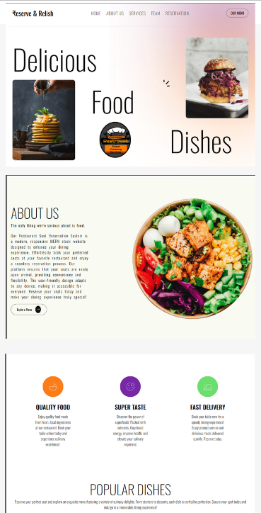
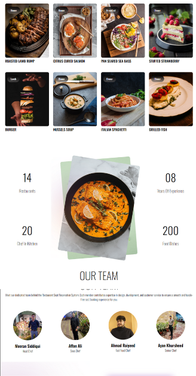
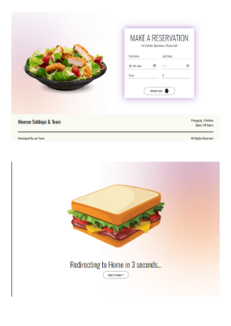
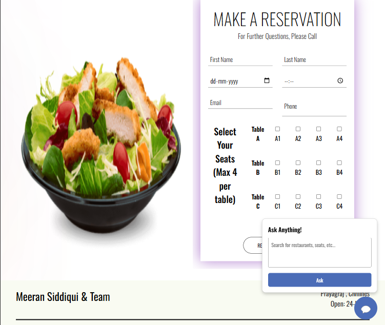
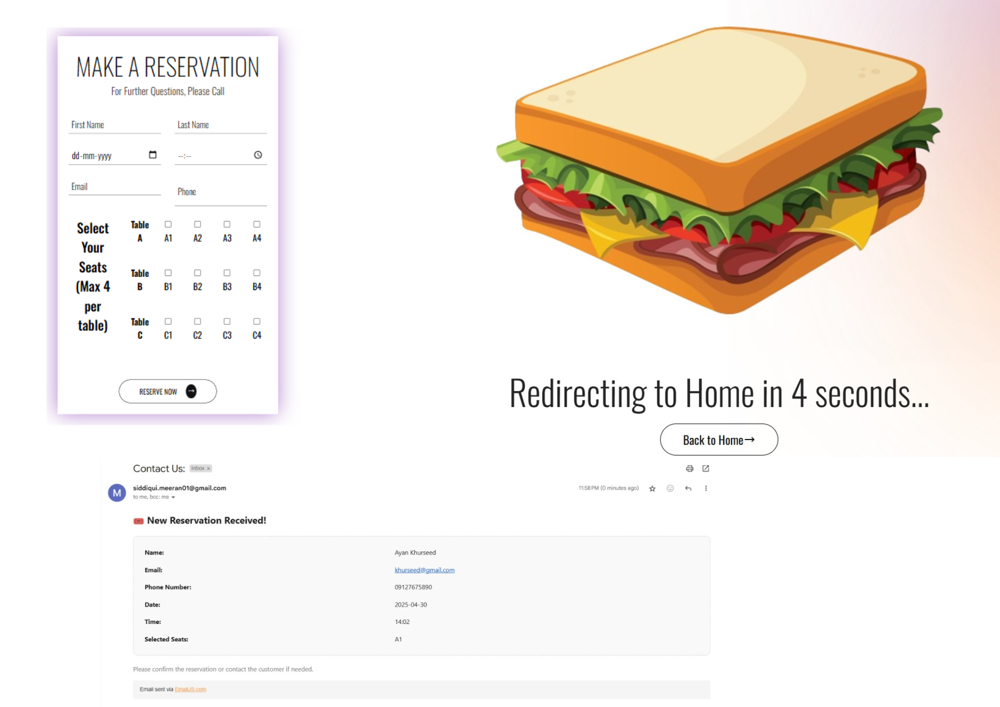

# 🎟️ Online Restaurants Seat Booking System  
  
  




## 📌 Project Overview  
This project is an **Online Restaurants Seat Booking System** built using the **MERN Stack (MongoDB, Express, React, and Node.js)**. It allows users to **reserve seats online** with real-time updates, ensuring a seamless and efficient booking process.  

## ✨ Features  
✅ **Seat Selection & Booking** – Users can view seat availability and book seats in real-time  
✅ **Secure Authentication** – Role-based access for users and admins  
✅ **Admin Panel** – Manage reservations, monitor availability, and control the system  
✅ **MongoDB Integration** – Real-time data storage and updates  
✅ **Responsive Design** – Ensures smooth performance on different devices  

## 🔧 Tech Stack  
- **Frontend:** React.js  
- **Backend:** Node.js, Express.js  
- **Database:** MongoDB  
- **Authentication:** JWT (JSON Web Tokens)  

## 🚀 Upcoming Features  
🔹 **Payment Gateway Integration** – Enable secure online payments  
🔹 **Email Notifications** – Confirmation and reminder emails for bookings  
🔹 **Seat Cancellation** – Allow users to modify/cancel their reservations  
🔹 **Analytics Dashboard** – Admins can analyze booking trends and system usage  
## 📂 Installation & Usage  
1. Clone this repository:  
   ```bash
   git clone https://github.com/M-Meeran-Siddiqui/Online_Restaurants_Seat_Booking.git
   ```
2. Navigate to the project folder:  
   ```bash
   cd Online-Restaurants-Seat-Booking
   ```

3. Install backend dependencies:  
   ```bash
   npm install
   ```

4. Navigate to the frontend folder:  
   ```bash
   cd client
   ```

5. Install frontend dependencies:  
   ```bash
   npm install
   ```

6. Start the backend and frontend servers:  
   ```bash
   # Start backend
   npm run server

   # Start frontend
   npm start
   ```

7. Open `http://localhost:5173` in your browser to use the app.  

